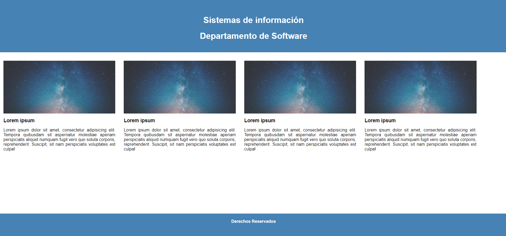
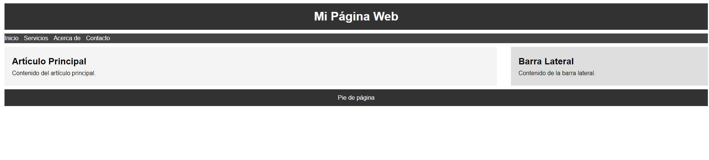

# Maquetación web haciendo uso de float

- Se le dará el siguiente código de HTML 

- Utilice CSS para obtener el siguiente resultado utilizando Floats
## Html llamado Index : Resultado 

## Html llamado Index2 : Resultado 

